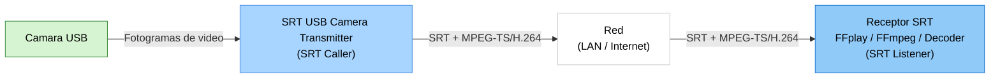

# SRT USB Camera Transmitter

> Transmisor en tiempo real de camara USB a SRT MPEG-TS/H.264 para Windows

> Languages: [English](index.md) | [中文](index.zh.md) | [한국어](index.ko.md) | [Español](index.es.md)

[](https://github.com/VideoSupporter/srt-usb-cam)
[](https://www.srtalliance.org/)

[Microsoft Store single free](https://apps.microsoft.com/detail/9P1TKLLFV43G)

[Microsoft Store multi](https://apps.microsoft.com/detail/9P9Z686RR6NJ)

SRT USB Camera Transmitter captura video de una camara USB en Windows y lo envia como un flujo MPEG-TS/H.264 por SRT.
La aplicacion usa Windows Media Foundation para la entrada de camara y la codificacion, multiplexa el video en MPEG-TS y se conecta a un receptor SRT en modo caller.

## Funciones principales

- **Captura de camara USB** - Selecciona una camara USB conectada y muestra una vista previa del video.
- **Transmision SRT en tiempo real** - Envia video MPEG-TS/H.264 a un SRT listener.
- **Seleccion automatica de formato** - Prioriza 1080p60 y, si es necesario, usa 1080p30, 720p30 o 640x480 30fps.
- **Controles de conexion** - Configura la direccion IP de destino, el puerto y la reconexion automatica.
- **Estadisticas en vivo** - Supervisa FPS, bitrate, cantidad de paquetes TS, reconexiones y el ultimo error.
- **Edicion multiinstancia** - La edicion multiinstancia permite ejecutar varias ventanas transmisoras.

## Configuracion de red



<script src="https://cdn.jsdelivr.net/npm/mermaid/dist/mermaid.min.js"></script>
<script>mermaid.initialize({startOnLoad:true,theme:'default'});</script>

## Captura de pantalla


## Como usar

### 1. Iniciar un receptor SRT

Inicia un SRT listener en el equipo receptor. Para una prueba rapida, usa FFplay:

```bash
ffplay "srt://0.0.0.0:9000?mode=listener"
```

### 2. Seleccionar una camara USB

Inicia SRT USB Camera Transmitter y elige la camara USB que quieres transmitir.
Si solo hay una camara conectada, la aplicacion puede seleccionarla automaticamente.

### 3. Configurar el destino

Introduce la direccion IP del receptor y el numero de puerto.
Para una prueba local en el mismo PC, usa `127.0.0.1`.

### 4. Iniciar la transmision

Haz clic en **Start connection** para conectarte al SRT listener y empezar a enviar video.
La vista previa y las estadisticas en vivo se actualizan durante la transmision.

## Ejemplos de recepcion

Reproducir el flujo:

```bash
ffplay "srt://0.0.0.0:9000?mode=listener"
```

Recibir y validar el flujo:

```bash
ffmpeg -i "srt://0.0.0.0:9000?mode=listener" -f null -
```

Guardar el flujo MPEG-TS recibido:

```bash
ffmpeg -i "srt://0.0.0.0:9000?mode=listener" -c copy capture.ts
```

## Requisitos del sistema

- Windows 11 x64
- Camara USB compatible con Windows Media Foundation
- Compatibilidad con codificacion H.264 por hardware
- Receptor compatible con SRT, como FFmpeg, FFplay u otro decodificador

## Notas

- La aplicacion envia en modo SRT caller. El receptor debe esperar en modo listener.
- El formato del flujo es MPEG-TS/H.264.
- La transmision de audio no esta incluida.
- La version actual no habilita cifrado SRT.

## Soporte

- [GitHub Issues](https://github.com/VideoSupporter/srt-usb-cam/issues)
- Contact: videosp.info@gmail.com
