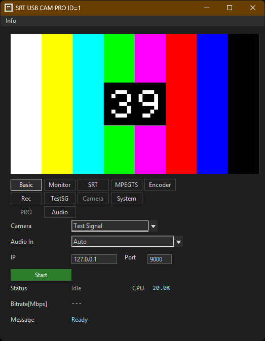
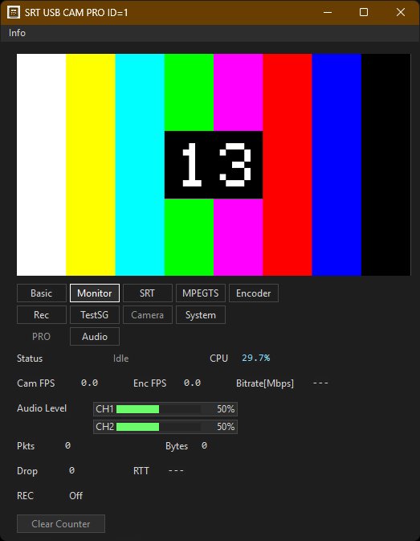
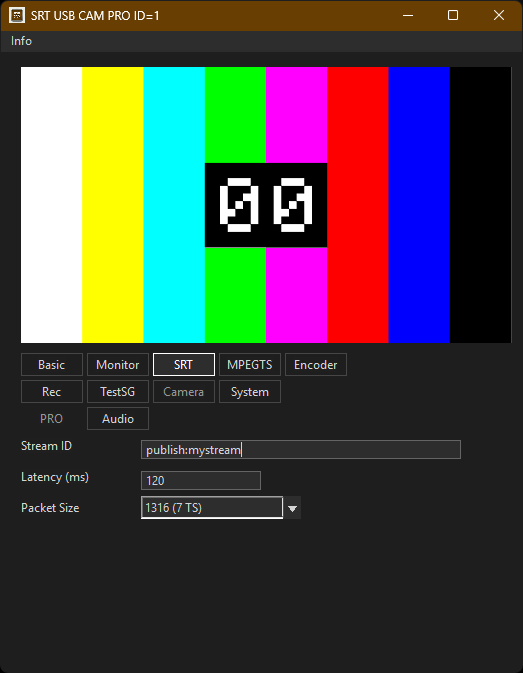
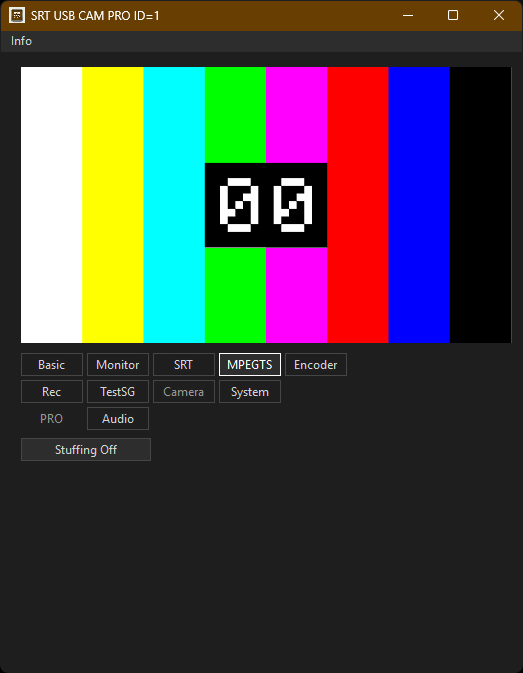
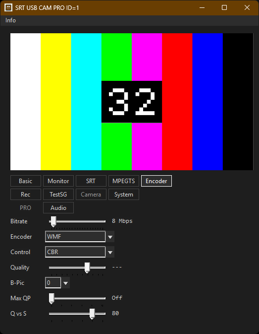
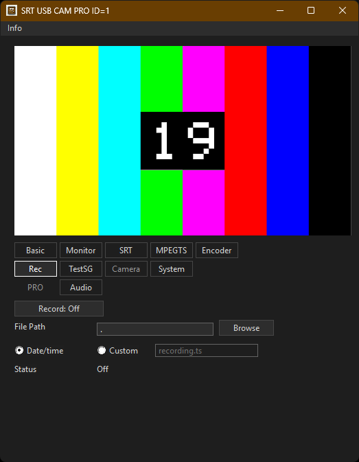
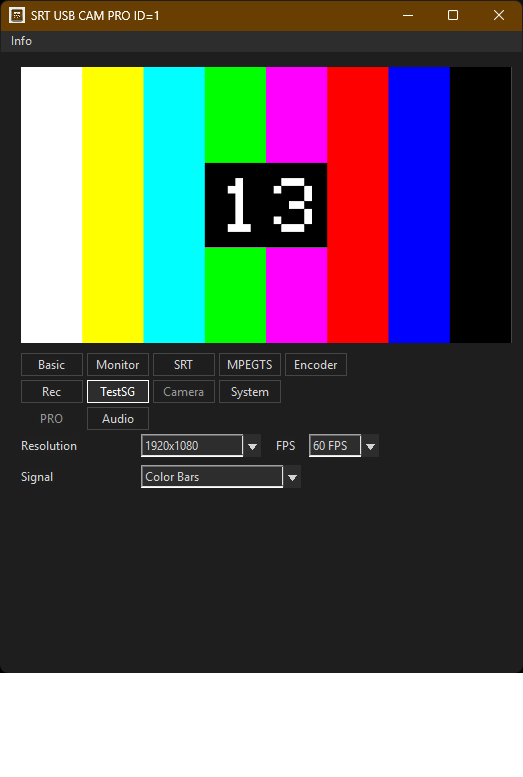
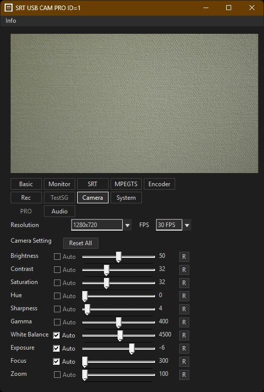
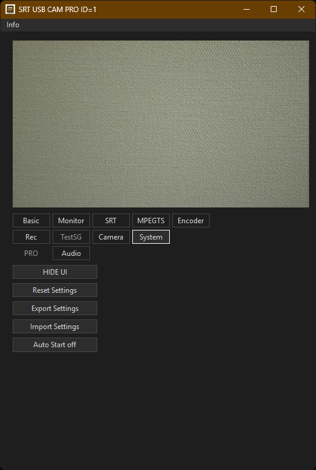
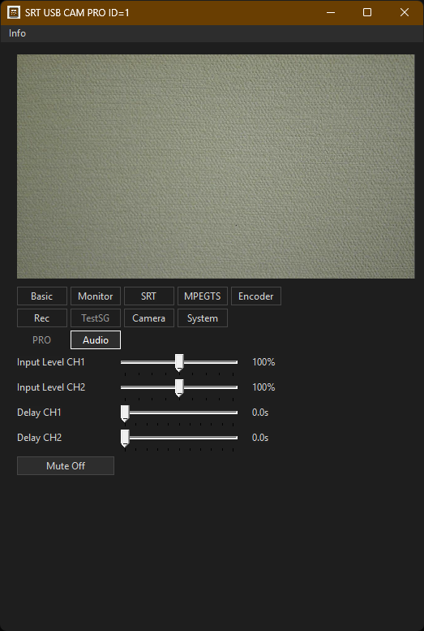

# SRT USB CAM

> Transmisor en tiempo real de camara USB a SRT MPEG-TS/H.264 para Windows

> Idiomas: [English](index.md) | Español | [한국어](index.ko.md) | [中文](index.zh.md) | [Deutsch](index.de.md) | [Français](index.fr.md) | [Italiano](index.it.md) | [Bahasa Indonesia](index.id-id.md) | [Deutsch (DE)](index.de-de.md) | [Français (FR)](index.fr-fr.md) | [Italiano (IT)](index.it-it.md)

[](https://github.com/VideoSupporter/srt-usb-cam)
[](https://www.srtalliance.org/)

## Descarga

- [Version gratuita en Microsoft Store](https://apps.microsoft.com/detail/9P1TKLLFV43G) - Una sola ventana transmisora.
- [Version PRO en Microsoft Store](https://apps.microsoft.com/detail/9NMW8TT83453) - Ejecuta varias ventanas transmisoras.

SRT USB CAM captura video de una camara USB en Windows y lo envia como un flujo MPEG-TS/H.264 por SRT.
Utiliza Windows Media Foundation para la entrada de camara y la codificacion, y puede multiplexar la entrada de audio USB como AAC-LC en MPEG-TS antes de conectarse a un receptor SRT en modo caller.

Este producto es la version gratuita. La version de pago, "SRT USB CAM PRO", permite ejecutar varias instancias.
https://apps.microsoft.com/detail/9NMW8TT83453

## Novedades

Version 1.0.4
- Se agrego compatibilidad para seleccionar el microfono integrado de una camara USB o un dispositivo de entrada de audio y multiplexarlo en MPEG-TS como audio AAC-LC.
- Se agregaron visualizacion de nivel de audio, silencio, retardo por canal CH1/CH2 y ajuste de nivel de entrada. (PRO ONLY)
- Se agregaron 25 / 29.97 / 50 / 59.94 FPS y audio de prueba de 1 kHz a Test Signal.
- Se agrego fallback a Test Signal cuando el formato de camara guardado no esta disponible en la camara actual.
- Se agregaron ajustes de Auto Start para omitir la operacion manual de inicio despues del arranque.

Version 1.0.3
- Se cambio la interfaz de usuario a un diseno con pestanas y se reorganizaron la visualizacion de los elementos y los controles para mejorar la usabilidad.
- Se agrego compatibilidad con la exportacion/importacion de configuracion y la configuracion del stream ID.
- Se agrego compatibilidad con REC. Ahora estan disponibles la grabacion MPEG-TS, la seleccion de carpeta de grabacion y la configuracion del nombre de archivo de grabacion, lo que facilita guardar el contenido transmitido.
- Se agrego la seleccion del codificador OpenH264.
- Se agrego compatibilidad con MediaMTX, incluida la transmision SRT para MediaMTX.
- Se agrego compatibilidad con null stuffing de MPEG-TS.

## Funciones principales

- **Captura de camara USB** - Selecciona una camara USB conectada y muestra una vista previa del video de entrada.
- **Transmision SRT en tiempo real** - Envia video MPEG-TS/H.264 a un SRT listener.
- **Transmision de audio AAC-LC** - Multiplexa audio de un microfono integrado de camara USB o dispositivo de entrada de audio en MPEG-TS.
- **Controles de conexion** - Configura la direccion IP de destino, el puerto y la reconexion automatica.
- **Estadisticas en vivo** - Supervisa FPS, bitrate, cantidad de paquetes TS, reconexiones y el ultimo error.
- **Grabacion MPEG-TS** - Guarda el stream MPEG-TS en un archivo durante la transmision.
- **Codificador OpenH264** - Selecciona la codificacion H.264 con OpenH264.
- **Monitor de audio** - Supervisa y ajusta el nivel de audio, silencio, retardo por canal CH1/CH2 y nivel de entrada. (PRO ONLY)
- **Multi-instancia** - Ejecuta varias ventanas de transmision al mismo tiempo. (PRO ONLY)

## Capturas de pantalla





















## Como usar

Inicia un SRT listener en el equipo receptor, por ejemplo con FFplay:

```bash
ffplay "srt://0.0.0.0:9000?mode=listener"
```

Selecciona una camara USB, configura la IP y el puerto de destino, y empieza la transmision.

## Ejemplos de recepcion

```bash
ffplay "srt://0.0.0.0:9000?mode=listener"
ffmpeg -i "srt://0.0.0.0:9000?mode=listener" -f null -
ffmpeg -i "srt://0.0.0.0:9000?mode=listener" -c copy capture.ts
```

## Requisitos del sistema

- Windows 11 x64
- Camara USB compatible con Windows Media Foundation
- Receptor compatible con SRT, como FFmpeg o FFplay

## Notas

- La aplicacion envia en modo SRT caller. El receptor debe esperar como listener.
- El formato del stream es MPEG-TS con video H.264 y audio AAC-LC opcional.
- La version actual no habilita cifrado SRT.

## Soporte

- [GitHub Issues](https://github.com/VideoSupporter/srt-usb-cam/issues)
- Contact: videosp.info@gmail.com
