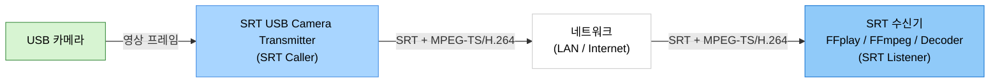

# SRT USB Camera Transmitter

> Windows용 USB 카메라 SRT MPEG-TS/H.264 실시간 송신 앱

> Languages: [English](index.md) | [中文](index.zh.md) | [한국어](index.ko.md) | [Español](index.es.md)

[](https://github.com/VideoSupporter/srt-usb-cam)
[](https://www.srtalliance.org/)

[Microsoft Store single free](https://apps.microsoft.com/detail/9P1TKLLFV43G)

[Microsoft Store multi](https://apps.microsoft.com/detail/9P9Z686RR6NJ)

SRT USB Camera Transmitter는 Windows에서 USB 카메라 영상을 캡처하고 MPEG-TS/H.264 스트림으로 SRT 전송하는 앱입니다.
Windows Media Foundation으로 카메라 입력과 인코딩을 처리하고, 영상을 MPEG-TS로 다중화한 뒤 SRT caller 모드로 수신기에 연결합니다.

## 주요 기능

- **USB 카메라 캡처** - 연결된 USB 카메라를 선택하고 입력 영상을 미리 봅니다.
- **실시간 SRT 전송** - MPEG-TS/H.264 영상을 SRT listener로 전송합니다.
- **자동 포맷 선택** - 1080p60을 우선 사용하고, 필요하면 1080p30, 720p30, 640x480 30fps로 폴백합니다.
- **연결 설정** - 대상 IP 주소, 포트, 자동 재연결을 설정합니다.
- **실시간 통계** - FPS, 비트레이트, TS 패킷 수, 재연결 횟수, 최근 오류를 확인합니다.
- **멀티 인스턴스 에디션** - 멀티 인스턴스 에디션에서는 여러 송신 창을 실행할 수 있습니다.

## 네트워크 구성



<script src="https://cdn.jsdelivr.net/npm/mermaid/dist/mermaid.min.js"></script>
<script>mermaid.initialize({startOnLoad:true,theme:'default'});</script>

## 스크린샷


## 사용 방법

### 1. SRT 수신기 시작

수신 PC에서 SRT listener를 시작합니다. 빠른 테스트에는 FFplay를 사용할 수 있습니다.

```bash
ffplay "srt://0.0.0.0:9000?mode=listener"
```

### 2. USB 카메라 선택

SRT USB Camera Transmitter를 실행하고 송신할 USB 카메라를 선택합니다.
카메라가 하나만 연결되어 있으면 앱이 자동으로 선택할 수 있습니다.

### 3. 대상 설정

수신기 IP 주소와 포트 번호를 입력합니다.
같은 PC에서 테스트할 때는 `127.0.0.1`을 사용합니다.

### 4. 전송 시작

**Start connection**을 클릭하면 SRT listener에 연결하고 영상 전송을 시작합니다.
전송 중에는 미리 보기와 실시간 통계가 갱신됩니다.

## 수신 예시

스트림 재생:

```bash
ffplay "srt://0.0.0.0:9000?mode=listener"
```

스트림 수신 및 검증:

```bash
ffmpeg -i "srt://0.0.0.0:9000?mode=listener" -f null -
```

수신한 MPEG-TS 저장:

```bash
ffmpeg -i "srt://0.0.0.0:9000?mode=listener" -c copy capture.ts
```

## 시스템 요구 사항

- Windows 11 x64
- Windows Media Foundation을 지원하는 USB 카메라
- H.264 하드웨어 인코딩 지원 환경
- FFmpeg, FFplay 또는 기타 SRT 호환 수신기

## 참고 사항

- 앱은 SRT caller 모드로 전송합니다. 수신기는 listener 모드로 대기해야 합니다.
- 스트림 형식은 MPEG-TS/H.264입니다.
- 오디오 전송은 포함되지 않습니다.
- 현재 버전에서는 SRT 암호화를 사용하지 않습니다.

## 지원

- [GitHub Issues](https://github.com/VideoSupporter/srt-usb-cam/issues)
- Contact: videosp.info@gmail.com
