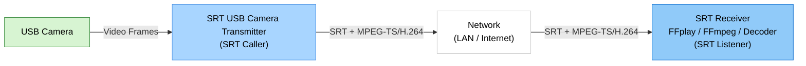

# SRT USB Camera Transmitter

> Real-time USB camera to SRT MPEG-TS/H.264 transmitter for Windows

> Languages: [English](index.md) | [中文](index.zh.md) | [한국어](index.ko.md) | [Español](index.es.md)

[](https://github.com/VideoSupporter/srt-usb-cam)
[](https://www.srtalliance.org/)

[Microsoft Store single free](https://apps.microsoft.com/detail/9P1TKLLFV43G)

[Microsoft Store multi](https://apps.microsoft.com/detail/9P9Z686RR6NJ)


SRT USB Camera Transmitter captures video from a USB camera on Windows and sends it as an MPEG-TS/H.264 stream over SRT.
It uses Windows Media Foundation for camera input and encoding, multiplexes the video into MPEG-TS, and connects to an SRT receiver in caller mode.

## Key Features

- **USB Camera Capture** - Select a connected USB camera and preview the input video.
- **Real-time SRT Transmission** - Send MPEG-TS/H.264 video to an SRT listener.
- **Automatic Format Selection** - Prefer 1080p60, then fall back to 1080p30, 720p30, or 640x480 30fps when needed.
- **Connection Controls** - Configure destination IP address, port, and automatic reconnection.
- **Live Statistics** - Monitor FPS, bitrate, TS packet count, reconnection count, and the latest error.
- **Multi-Instance Edition** - Run multiple transmitter windows when using the multi-instance edition.

## Network Configuration



<script src="https://cdn.jsdelivr.net/npm/mermaid/dist/mermaid.min.js"></script>
<script>mermaid.initialize({startOnLoad:true,theme:'default'});</script>

## Screenshot


## How to Use

### 1. Start an SRT Receiver

Start an SRT listener on the receiving machine. For a quick test, use FFplay:

```bash
ffplay "srt://0.0.0.0:9000?mode=listener"
```

### 2. Select a USB Camera

Launch SRT USB Camera Transmitter and choose the USB camera to send.
When only one camera is connected, the app can select it automatically.

### 3. Configure Destination

Enter the receiver IP address and port number.
For local testing on the same PC, use `127.0.0.1` and the port used by the listener.

### 4. Start Transmission

Click **Start connection** to connect to the SRT listener and begin sending video.
The preview and live statistics update while transmission is active.

## Receiver Examples

Play the stream:

```bash
ffplay "srt://0.0.0.0:9000?mode=listener"
```

Receive and validate the stream:

```bash
ffmpeg -i "srt://0.0.0.0:9000?mode=listener" -f null -
```

Save the received MPEG-TS stream:

```bash
ffmpeg -i "srt://0.0.0.0:9000?mode=listener" -c copy capture.ts
```

## System Requirements

- Windows 11 x64
- USB camera supported by Windows Media Foundation
- H.264 hardware encoding support
- SRT-compatible receiver such as FFmpeg, FFplay, or another SRT decoder

## Notes

- The app sends video in SRT caller mode. The receiver must listen before or during connection.
- The stream format is MPEG-TS with H.264 video.
- Audio transmission is not included.
- SRT encryption is not enabled in the current version.

## Support

- [GitHub Issues](https://github.com/VideoSupporter/srt-usb-cam/issues)
- Contact: videosp.info@gmail.com
